# System Architecture

## Architecture Diagram

```mermaid
graph TB
    subgraph "Client Layer"
        User[👤 User/Browser]
        Attacker[Attacker/Pentester]
    end

    subgraph "Reverse Proxy Layer - Port 80"
        Traefik[Traefik Reverse Proxy<br/>Port 80, 8888]
    end

    subgraph "Application Layer"
        Frontend[Vue.js Frontend<br/>Main Store App<br/>Port 3000]
        Backend[Express.js Backend<br/>REST API<br/>Port 3001]
        Scoreboard[Vue.js Scoreboard<br/>Team Scores<br/>Port 5174]
        TeamPage[Vue.js Team Page<br/>Team Dashboard<br/>Port 5175]
        ImageServer[PHP Image Server<br/>File Upload<br/>Port 8090]
    end

    subgraph "Data Layer"
        Postgres[(PostgreSQL DB<br/>Port 5432)]
        Images[Image Storage<br/>Volume Mount]
        Logs[Backend Logs<br/>Volume Mount]
    end

    subgraph "Bot Services"
        Dorothy[Boomer Bot Dorothy<br/>Forum User]
        Admin[Boomer Bot Admin<br/>Privileged User]
    end

    %% User interactions
    User -->|HTTP :80| Traefik
    Attacker -->|HTTP :80| Traefik

    %% Traefik routing
    Traefik -->|"/"| Frontend
    Traefik -->|"/api"| Backend
    Traefik -->|"/scoreboard"| Scoreboard
    Traefik -->|"/team-page"| TeamPage
    Traefik -->|"/images"| ImageServer
    Traefik -->|"/api/upload-image"| ImageServer

    %% Frontend communications
    Frontend -->|API Calls| Backend
    Frontend -->|Load Images| ImageServer
    Frontend -->|XHR/Fetch| Backend
    
    %% Team Page communications
    TeamPage -->|API Calls| Backend
    TeamPage -->|View Scores| Scoreboard
    
    %% Scoreboard communications
    Backend -->|SSE: Bot Status| Scoreboard
    Scoreboard -->|Poll Scores| Backend

    %% Backend interactions
    Backend -->|Prisma ORM| Postgres
    Backend -->|Write Logs| Logs

    %% Image Server interactions
    ImageServer -->|Store/Read| Images
    Backend -.->|Reference URLs| ImageServer

    %% Bot interactions
    %% Bot interactions
    Dorothy -->|HTTP requests| Traefik
    Admin -->|HTTP requests| Traefik
    %% Styling
    classDef vulnerable fill:#ff6b6b,stroke:#c92a2a,color:#fff
    classDef secure fill:#51cf66,stroke:#2f9e44,color:#000
    classDef proxy fill:#339af0,stroke:#1864ab,color:#fff
    classDef data fill:#ffd43b,stroke:#fab005,color:#000
    
    class Frontend,Backend,ImageServer vulnerable
    class Traefik proxy
    class Postgres,Images,Logs data
```



## Component Details

### Entry Point

- **Traefik Reverse Proxy**: Single entry point on port 80, routes traffic to appropriate services based on path and priority
- **Dashboard**: Available on port 8888 for monitoring

### Frontend Applications

1. **Frontend (Vue.js)** - Main e-commerce application
   - **Route**: `/` (priority 1)

2. **Scoreboard (Vue.js)** - Real-time competition tracking
   - Bot activity status via SSE (`/api/bot-activity/stream`)
   - Scores refreshed via polling
   - **Route**: `/scoreboard`

3. **Team Page (Vue.js)** - Team dashboard
   - **Route**: `/team-page`

### Backend Services

1. **Backend API (Express.js)**
   - REST API with multiple routes:
     - `/api/products` - Product catalog
     - `/api/orders` - Order management
     - `/api/users` - User authentication & management
     - `/api/admin` - Admin operations (honeypot)
     - `/api/scores` - Scoreboard data
     - `/api/forum` - Forum/community features
     - `/api/hackathon` - Team submissions
     - `/api/bot-activity` - Bot status SSE stream
   - Uses Prisma ORM for database access
   - JWT authentication with cookies
   - Rate limiting (50 req/min)
   - **Route**: `/api` (priority 10)

2. **Image Server (PHP)**
   - File upload endpoint (`upload.php`)
   - Static image serving
   - **Routes**: 
     - `/images` (priority 10) - Serve images
     - `/api/upload-image` (priority 20) - Upload endpoint

### Database
- **PostgreSQL 15**: Persistent data storage
  - Volume: `postgres-data`

### Automated Services
1. **Boomer Bot Dorothy** - Simulated user
   - Username: `DorothyWilliams`
   - interacts with forum messages every 10 minutes
   - Interacts with store

2. **Boomer Bot Admin** - Simulated admin user
   - Username: `admin`
   - Privileged account for exploitation
   - interacts with forum messages every 10 minutes

## Network Architecture


All services communicate within the `store-network` Docker bridge network. Only Traefik exposes port 80 to the host.

## Data Flow


## Deployment Modes

### Development Mode
```bash
npm run docker:up     # DB + Image Server only
npm run dev           # Run apps locally
```
- Direct access to each service on separate ports
- Hot reload enabled
- Verbose logging

### Production Mode
```bash
docker compose up --build
```
- All services containerized
- Traefik reverse proxy routing
- Single entry point (port 80)
- Production logging

## Port Mapping

| Service | Internal Port | External Port (Dev) | Production Route |
|---------|--------------|---------------------|------------------|
| Traefik | 80, 8080 | 80, 8888 | `:80` |
| Frontend | 3000 | 3000 | `/` |
| Backend | 3001 | 3001 | `/api` |
| Scoreboard | 5174 | 5174 | `/scoreboard` |
| Team Page | 5175 | 5175 | `/team-page` |
| Image Server | 8090 | 8080 | `/images`, `/api/upload-image` |
| PostgreSQL | 5432 | 5432 | Internal only |

## Technology Stack

- **Frontend**: Vue.js 3 + Vite + Pinia (state management)
- **Backend**: Express.js + Prisma ORM + PostgreSQL
- **Reverse Proxy**: Traefik
- **Bots**: Node.js automation scripts
- **Image Server**: PHP 8 + Apache
- **Container**: Docker + Docker Compose
- **Monorepo**: Turborepo
